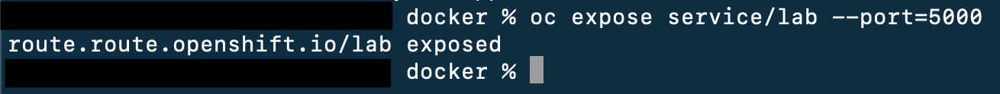
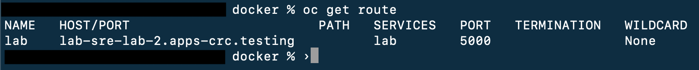
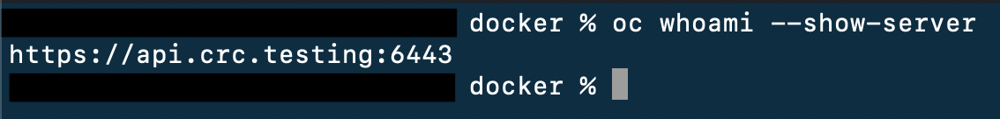
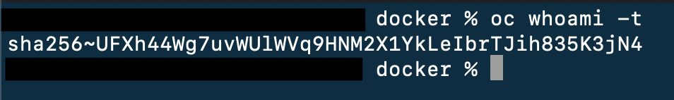

In this repository:

https://github.ibm.com/jacob-villegas/sre-test

Git repository: git@github.ibm.com:jacob-villegas/sre-test.git

There is the necessary code to run a simple rest-api in a docker container that returns a json file.

Exercise
- Create your own GIT repository, within, Implement the necessary automation to deploy the container in the cloud provider of your choice (IBM Cloud, AWS, GCP, etc.).
- Use IaaC concepts
- Add a readme file that explains step by step how someone else could run the automation to do the deployment themselves without needing help.

Extra bonus:

Deploy the container to a Kubernetes cluster in the cloud.

# Solutions

We created a repository on the platform of your choice, in this case the explanation will be using Github since 2 solutions were implemented, both with OpenShift, one local and one in the cloud using the platform's dev sandbox.

I assume that you already know how to create a repository, have a reference image of the created repository, and have pushed the app you want to deploy.

For this deployment, we will use a public repository for convenience.


## Deploy Local

We need to have OpenShift Local installed, which we will use from [Podman](https://podman.io/docs/installation), you can find the installation guide in the link. Inside Podman, you will find the guide to install [Openshift](https://access.redhat.com/documentation/en-us/red_hat_openshift_local/2.18/html/getting_started_guide/installation_gsg), which is the same link.


With Podman and OpenShift Local ready and running, we will execute the following commands:

- Verify that the machine is started and running:
 ```bash
 crc start
 ```

f everything is fine, it should look similar to the image. If it takes a little longer, it may be because the OpenShift machine is starting up.

1. Add the `oc` command to the path to use it in the terminal:
```bash
eval $(crc oc-env)
```

2. Log in to OpenShift:
```bash
oc login -u developer -p developer https://api.crc.testing:6443
```

3. Create a project for our app:
```bash
oc new-project sre-lab-2
```

4. Now let's create our app:
```bash
oc new-app --name=lab https://github.com/bcamposibm/Lab-2.git#main
```
If everything goes well, it should look like this:


5. Now we expose our app, **it is important to open the port that our app uses**:
```bash
oc expose service/lab --port=5000
```

With this, our application should be ready for our use.

6. We can get the **url** with:
```bash
oc get route
```


The **HOST/PORT** is the path that we have to copy in the browser and that's it, we can now consume our app. Just remember to change **HTTPS** to **HTTP** if our app needs it, this is because some browsers redirect to HTTPS by default.

## Deploy Sandbox

Taking into account that we have the `Sandbox` on the web platform, we will need to obtain the `login` credentials in the following way:


- This will show us a new tab where we will click on `DevSandbox`


- Then we click where it says `Display Token` and we will see our credentials.


- Then we copy what is in `Log in with this token` and our terminal and we will be able to use our terminal to manage the OpenShift sandbox.

- In the case of deploying to OpenShift Sandbox, Github Actions was used. For this, we will need some quick configurations in our repository prior to deployment.

### Openshift Sandbox Credentials

- We assume that you have a `Red Hat` account and that you have enabled the `DevSandbox`, which is enabled for 30 days. We get our necessary credentials for `Github Actions`:

1. Server:
```bash
oc whoami --show-server
```



2. Token:

```bash
oc whoami -t
```



- We will register this data in our Github repository in the **SETTINGS** section, note that everything is in the repository, **NOT** in the Github account or profile.


- As we can see in the `image`, we first click on **Settings**, then go to **Secrets and variables**, then to **Actions** and create the secrets we need from the green **New repository secret** button. It looks something like this:


- `Name`: OPENSHIFT_SERVER / `Secret`: Output bash `oc whoami --show-server`
- `Name`: OPENSHIFT_TOKEN / `Secret`: Output bash `oc whoami -t`
- `Name`: IMAGE_REGISTRY_PASSWORD / `Secret`: Token access of your Dokerhub account

Having these **Secrets** created in our repository, we proceed to create our Action for the deployment.


### Github Action

In our repository, we go to the `Actions` tab to configure our workflow that will be responsible for deploying to our `Openshift Sandbox` by clicking on `New workflow`.


When we go to `new workflow` we will search for `openshift` and click on `configure`.


After clicking on `configure`, we will have a file called `openshift.yml` which we will have to edit some lines of the document.


Now we will start by modifying the lines we need to make it work.

- First of all, we can see that on lines **33** and **34** there are some **secrets** that we created previously.


Now we will add the missing `ENVs`.

- Line 36: Here goes the name of the project created in Openshift, in the case of using the `Sandbox` we only have the default one in my case `bcamposibm-dev`.
```bash
OPENSHIFT_NAMESPACE="bcamposibm-dev"
```

- Line 39: Name of the app we want it to have when deploying.
```bash
APP_NAME="lab"
```

- Line 44: The port that our app will use, in this case `5000`.
```bash
APP_PORT="5000"
```


Now we will configure our `image registry`. As I mentioned before, I use Docker in my case, so we will modify lines **48, 49, and 50** accordingly.

- `IMAGE_REGISTRY would be the platform plus your username`. In my case, the username is the same as the one I have on GitHub, so I simply changed the URL to Docker.
- `IMAGE_REGISTRY_USER` is the username for the platform.
- `IMAGE_REGISTRY_PASSWORD` is the access token that we generated on the platform we use, Docker in my case. This was the other secret that we registered. Since this data is credentials, it is not recommended to use it directly in the code.


To finish modifying the file, we need to comment out lines **70, 71, 72, and 73**. This is because we do not have a **CRDA Scan** created or configured yet.


After configuring everything, we click on `Commit changes...` and then `Commit changes` again to publish the changes and automatically execute the workflow.

To see the workflow process, we simply go to `Actions` and there we can see the log if we want or need to.


If we click on `update openshift.yml`, in my case, it would look something like this:


And well, if you keep clicking on the options, you will be able to see more details about it.

If everything went well, that is, a green check, we can go to our sandbox and see the pod already online.

By clicking on `Topology` and selecting our project, we will be able to see something like this:


To finish, to open our app in the browser, we simply click on the red box icon to open the URL and that's it.

